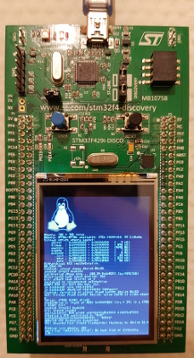

Linux on the STM32F429I Discovery board with Buildroot
======================================================

The project is a set of patches and configuration files to build a bootloader and a Linux based system image with a minimal root file system for the great [STM32F429I Discovery board](http://www.st.com/en/evaluation-tools/32f429idiscovery.html).

Build
-----

Let's download, extract and patch Buildroot:

`$ make bootstrap`


Then build:

`$ make build`


Run
---

Write U-Boot, the kernel and the root file system in the internal flash:

`$ make flash`

U-Boot is configured to run the kernel in XIP mode directly from the internal flash. The root file system is in a MTD partition also in the internal flash.



Boot log
--------

```
U-Boot 2010.03 (***)

CPU  : STM32F4 (Cortex-M4)
Freqs: SYSCLK=180MHz,HCLK=180MHz,PCLK1=45MHz,PCLK2=90MHz
Board: STM32F429I-DISCOVERY board,Rev 1.0
DRAM:   8 MB
Using default environment

Hit any key to stop autoboot:  0 
## Booting kernel from Legacy Image at 08020000 ...
   Image Name:   Linux-2.6.33-arm1
   Image Type:   ARM Linux Kernel Image (uncompressed)
   Data Size:    738336 Bytes = 721 kB
   Load Address: 08020040
   Entry Point:  08020041
   Verifying Checksum ... OK
   Loading Kernel Image ... OK
OK

Starting kernel ...

Linux version 2.6.33-arm1 (***) (***) #1 Sun Mar 4 20:53:01 CET 2018
CPU: ARMv7-M Processor [410fc241] revision 1 (ARMv7M)
CPU: NO data cache, NO instruction cache
Machine: STMicro STM32
Ignoring unrecognised tag 0x54410008
Built 1 zonelists in Zone order, mobility grouping off.  Total pages: 1778
Kernel command line: stm32_platform=stm32429-disco mem=7M console=ttyS2,115200n8 consoleblank=0 root=/dev/mtdblock0 rdinit=/sbin/init video=vfb:enable,fbmem:0x90700000,fbsize:0x100000
PID hash table entries: 32 (order: -5, 128 bytes)
Dentry cache hash table entries: 1024 (order: 0, 4096 bytes)
Inode-cache hash table entries: 1024 (order: 0, 4096 bytes)
Memory: 7MB = 7MB total
Memory: 6976k/6976k available, 192k reserved, 0K highmem
Virtual kernel memory layout:
    vector  : 0x00000000 - 0x00001000   (   4 kB)
    fixmap  : 0xfff00000 - 0xfffe0000   ( 896 kB)
    vmalloc : 0x00000000 - 0xffffffff   (4095 MB)
    lowmem  : 0x90000000 - 0x90700000   (   7 MB)
    modules : 0x90000000 - 0x90800000   (   8 MB)
      .init : 0x9000a000 - 0x9000e000   (  16 kB)
      .text : 0x08028000 - 0x080c4000   ( 624 kB)
      .data : 0x90008000 - 0x90018460   (  66 kB)
Hierarchical RCU implementation.
NR_IRQS:90
Console: colour dummy device 80x30
Calibrating delay loop... 168.34 BogoMIPS (lpj=841728)
Mount-cache hash table entries: 512
bio: create slab <bio-0> at 0
Switching to clocksource cm3-systick
ROMFS MTD (C) 2007 Red Hat, Inc.
io scheduler noop registered
io scheduler deadline registered (default)
Console: switching to colour frame buffer device 60x53
fb0: Virtual frame buffer device, using 1024K of video memory
Serial: STM32 USART driver
stm32serial.2: ttyS2 at MMIO 0x40004800 (irq = 39) is a STM32 USART Port
console [ttyS2] enabled
brd: module loaded
uclinux[mtd]: ROM probe address=0x8120000 size=0x57000
Creating 1 MTD partitions on "ROM":
0x000000000000-0x000000057000 : "ROMfs"
ARMv7-M VFP Extension supported
VFS: Mounted root (romfs filesystem) readonly on device 31:0.
Freeing init memory: 16K
starting pid 12, tty '': '/etc/init.d/rcS'
can't run '/etc/init.d/rcS': No such file or directory
starting pid 13, tty '': '-/bin/sh'
/ #
```

Changelog
---------

* 0.1
  * Buildroot 2016.08.1
  * GCC 4.4.1 (external)
  * U-Boot 2010.03
  * Linux 2.6.33
  * Busybox 1.25.0
  * OpenOCD 0.10.0
